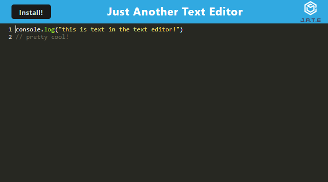

# Text Editor

  

  #### Table of Contents
  
  1. [Description](#description)
  2. [Installation Instructions](#installation-instructions)
  3. [Usage](#usage)
  4. [Test Instructions](#test-instructions)
  5. [License](#license)
  6. [Credits](#credits)
  
  ## Description
  * Welcome to Text Editor! This is a website where the user can use a text editor for the purpose of saving code snippets online or offline. You can even install it as an app.

  
  
  ## Installation Instructions
  * In order to install and use this program locally, you must have node.js installed first. Download this repository and access it in your terminal of choice. When you are in the root folder enter "npm install" in the terminal to install all necessary packages. Afterwards, type "npm start" into the prompt to begin the program. 
  
  This program has also been deployed through Heroku, which you can access here: (https://secret-eyrie-82289.herokuapp.com/)
  
  ## Usage
  * Use this to save easy to access code snippets on your computer, so that you can quickly access it for your coding projects.
  
  ## Test Instructions
  * No testing required.
  
  ## License
  * The application is covered under the following license:
    [mit](https://choosealicense.com/licenses/mit)
  
  ## Credits
  * This project was created by: Jared Keebler (github: jakekeebler | email: jakekeebler@gmail.com)